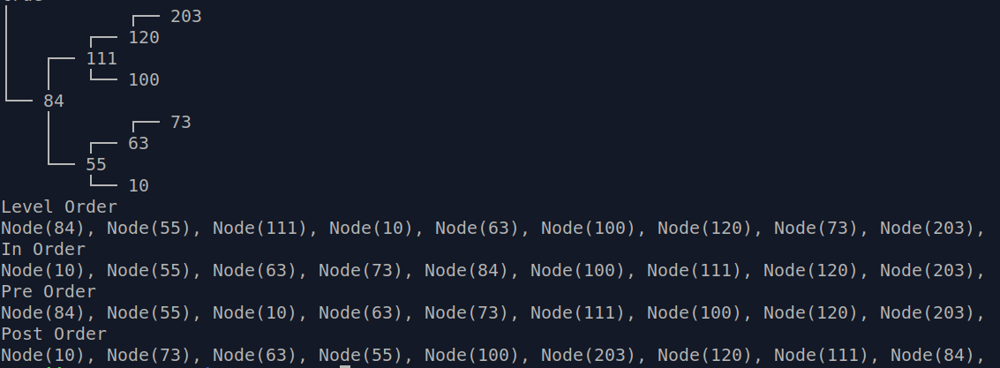

# Binary Search Tree (BST)
## Implemented in Ruby

According to the specifications mentioned [here][1].

This is a very simple implementation of the BST data structure made entirely for learning purposes.

## Screenshot

[1]: https://www.theodinproject.com/lessons/ruby-binary-search-trees